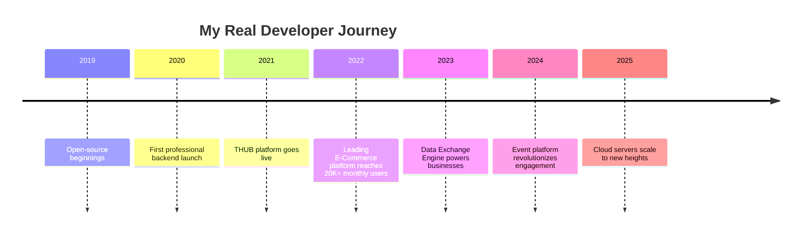

<!-- Modern, Pixel-Perfect GitHub Profile README for shadythedecipher -->

<h1 align="center" style="font-family:SF Pro Display, Montserrat, Arial, sans-serif; font-weight:700;">
  Hi, I'm Shadrack Abely Mwang'onda 👨‍💻
</h1>

Senior Engineer | Tanzania 
Crafting clarity from complexity. Building with precision, humility, and vision.

---

## 🚀 About Me

I'm a senior front-end and API developer rooted in Tanzania, driven by a passion for elegant code and impactful products.  
Every line I write is a step closer to simplicity and clarity.  
- **Mobile-first** is a mindset, not a buzzword.
- **Storytelling** is in every commit.
- I believe in building things that last, scale, and inspire.

---

## 🧭 My Journey

From day one, I’ve built platforms that empower real growth.  
- **2019:** Began with open-source, embracing the spirit of sharing and learning.
- **THUB:** Engineered a platform where people unlock financial and knowledge potential—impacting thousands across Tanzania.
- **E-Commerce (NDA):** Developed and scaled a leading home décor & appliances site, serving 20K+ active monthly users, pioneering seamless shopping experiences.
- **Data Exchange Engine:** Built robust integrations for fast, secure data movement—connecting businesses and driving efficiency.
- **Event Platform Core:** Enabled effortless event management and engagement, making organization simple and impactful.
- **Scalable Cloud Server:** Architected backend systems for reliability, performance, and future growth—leveraging cloud-native designs on AWS and Azure.

## 📅 Timeline

  
---

## 🛠️ My Tech Stack

  

- **Tailwind CSS**: pixel-perfect UI, responsive layouts
- **TypeScript/Javascript**: for robust frontends and scalable APIs
- **Pure Java**: heavy backend lifting, enterprise-ready
- **Dart & Flutter**: beautiful cross-platform mobile apps
- **Azure & AWS**: cloud hosting, scaling with confidence

---

## 🚀 Featured Projects

| 🏆 Project         | 💡 What It Does                                                            | 🛠️ Tech Focus          |
|------------------- |---------------------------------------------------------------------------|------------------------|
| THUB              | Platform empowering financial growth and learning for thousands.            | TypeScript, Tailwind, Java, AWS, Azure |
| E-Commerce (NDA)  | Leading site for home décor & appliances, serving 20k+ monthly users.       | TypeScript, Tailwind, Java, AWS        |
| Data Exchange Engine | Built secure, fast, and reliable data integrations.                      | Java, JavaScript, Azure                |
| Event Platform Core  | Enabling seamless event organization and user engagement.                | Java, Tailwind CSS                     |
| Scalable Cloud Server | Architected robust cloud-native backend systems.                        | Java, TypeScript, AWS                  |

## 📈 Stats & Impact

  
  

  

---

## 🤝 Connect

  
  
  

  <em>Building for tomorrow, inspired by Tanzania, with the humility of a true senior.</em>

<!--
  Crafted for mobile-first experience.
  Real journey, real code, real impact.
  If you see this, you know what senior looks like.
-->
